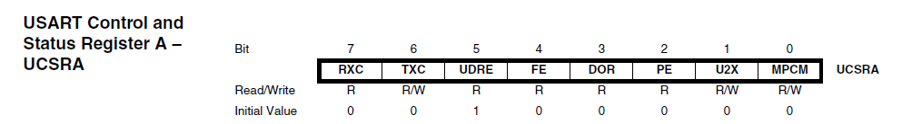
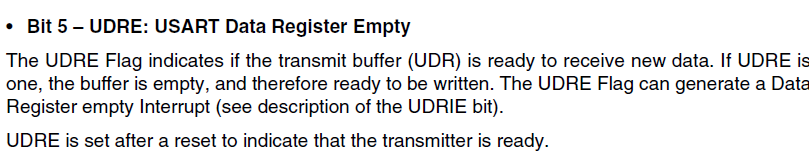

## About Task

This project is an implement an UART protocol in atmega32 microcontroller
in datasheet folder you will have the datasheet of atmega 

## functions
in this code you have three functions one for the initialization and another for the transmit and another one for receiving

## Links
[resource number one]("https://aki-technical.blogspot.com/2020/09/atmega32-avr-universal-asynchronous.html")
this web i took the circuit to implement my program on it

[AVR Learning]("https://www.youtube.com/playlist?list=PLhx4zaYkEjI8C2N7DgIn8Ce75qM0jb1nY") 
this playlist helped me to learn and dealing with the data registers and Ports 

## Code
### this code is taken from  datasheet
```
#define F_CPU 16000000UL
#include <avr/io.h>
#define BAUD 9600
#define MYUBRR ((F_CPU / (16UL * BAUD)) - 1)
```
these photos will explain


```
    void USART_Init(unsigned int ubrr) {
	UBRRH = (unsigned char)(ubrr >> 8); 
	UBRRL = (unsigned char)ubrr;

	UCSRB = (1 << RXEN) | (1 << TXEN);  
	UCSRC=(1<<URSEL)|(1<<UCSZ1)|(1<<UCSZ0);
    }
```
UBRRH stands for USART Baud rate register high and it responsible for the baud of bits

UBRRL same as above but L is LOW

UCRSB and UCRSC are two registers responsible for Control and status

RXEN,TXEN enabling the transmitting and receiving

URSEL make sure that we are working at Register C not the register of Baud

UCSZ1 and UCSZ0 no parity check and there are one stop bits


---------------------------------------------
```
void USART_Transmit(unsigned char data) {
	while (!(UCSRA & (1 << UDRE)));
	UDR = data;
}
```
this code is making sure that the data is Waiting for empty transmit buffer




```
unsigned char USART_Receive(void) {
	while (!(UCSRA & (1 << RXC)));
	return UDR;
}
```


### the main code is for transmitting  number between 0 and 8 and receiving that number incremented by one

```
int main(void) {
	USART_Init(MYUBRR);
    while(1){
	char received_char = USART_Receive();
	char enter = USART_Receive();
	if(enter == '\r'){  
	if (received_char >= '0' && received_char <= '9') {
		int num = received_char - '0';  
		num += 1;
		if(num == 10){
		  USART_Transmit('0');
		  continue;
		}                      
		USART_Transmit(num + '0');
		USART_Transmit('\r');      
	}
	}
	}
```
this code basically is take number from the Virtual terminal and send it to atmega32 avr and this microcontroller transmit number incremented by one
'\r' making sure that when you type the number between 0 and 9 is going inside if condition
every number has ASCII code when you take that number as char and convert it to the int it will be ASCII code then to make sure that you have the right number you should subtract it from the 0's ASCII code 

